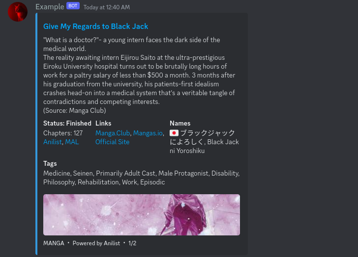

# coffeeani

<component-coghero cog="coffeeani" desc="Search anime, manga (manhwa/manhua/light novels), users, and characters from Anilist. See series info, status, episodes/chapters, and tags."></component-coghero>

A Discord bot for searching anime, manga (manhwa/manhua/light novels), users, and characters from Anilist.

## Features

- Synopsis/summary with official sources, streaming sites, and links
- English language titles with Native language and Romaji/Romanization support
- Series status (Not yet released, Releasing, Finished)
- Series preview embed images
- Genre/Topic tags
- Media sub-types (Oneshot, Novel, ONA, etc.)

This cog is a customized fork of anisearch by [Jintaku-Cogs-V3 (AGPL-3.0)](https://github.com/Jintaku/Jintaku-Cogs-V3/blob/master/LICENSE) and [Wyn-RedV3Cogs (GPL-3.0)](https://github.com/TheWyn/Wyn-RedV3Cogs/blob/master/anisearch/LICENSE). Thank you for creating anisearch!

[This cog is open-source (AGPL-3.0).](https://github.com/coffeebank/coffee-cogs/tree/master/coffeeani)
