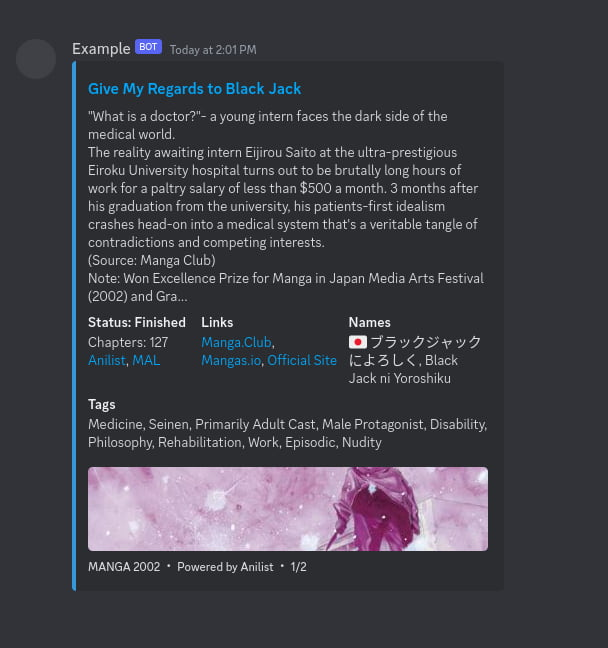
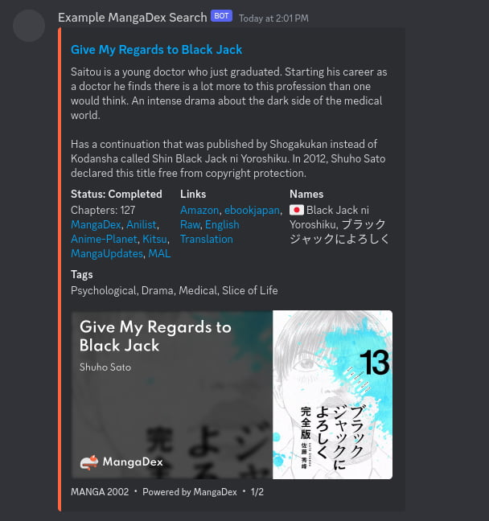

#️⃣ Supports Slash Commands

# coffeeani

An open-source Discord bot for searching anime 🎌, manga 📰, manhwa 🌺, light novels 📚, and anime characters 🧑‍🤝‍🧑.

<component-coghero cog="coffeeani" desc="Search anime, manga (manhwa/manhua/light novels), and characters. See series info, status, episodes/chapters, and tags." use_desc_only="true" dpy="true"></component-coghero>

The comprehensive manga/manhwa Discord bot for searching Anilist, MangaDex, Batoto, and Kakao Webtoons.

## Features

- Synopsis/summary with official sources, streaming sites, and links
- Series status (Not yet released, Releasing/Ongoing, Finished/Completed)
- Series preview embed images
- Series genre/topic tags
- Anime: Next airing episode
- Media sub-types (Oneshot, Novel, ONA, etc.)
- Media release year
- Media country/language flags
- English language titles with Native language and Romaji/Romanization support

### Anilist

- Search anime (+ donghua)
- Search manga (+ manhwa/manhua/webtoons)
- Search light novels
- Search anime/manga characters
- Search Anilist users

### MangaDex

- Search manga (+ manhwa/manhua/webtoons)

### Batoto

- Search manga (+ manhwa/manhua/webtoons)

### Kakao Webtoon

- Search manhwa/webtoons
- Korean romanizations
- Korean translations (DeepL integration)

 

## Commands

- `/anime`
- `/animecharacter`
- `/manga`, aliases=`["manhwa", "manhua", "lightnovel"]`

### Services

- `/anilist`
  - `user`, `manga`
- `/batoto`
- `/kakao`
- `/mangadex`

 

## Frequently Asked Questions

### How do I install Coffeeani?

Coffeeani is available as an independently hosted Discord bot at [https://github.com/coffeebank/coffeeani-dpy](https://github.com/coffeebank/coffeeani-dpy).

### What is the prefix?

Coffeeani-dpy works with Slash Commands, as well as @pinging the bot.

For Red bots, use the Red bot prefix.

### What languages does Coffeeani support?

Coffeeani currently only supports English. Foreign language descriptions are translated to English with DeepL integration.

 

## About

This cog is a customized fork of **anisearch** by [Jintaku-Cogs-V3 (AGPL-3.0)](https://github.com/Jintaku/Jintaku-Cogs-V3/blob/master/LICENSE) and [Wyn-RedV3Cogs (GPL-3.0)](https://github.com/TheWyn/Wyn-RedV3Cogs/blob/master/anisearch/LICENSE). Thank you for creating anisearch!

This bot is also available on **Matrix** ([Element](https://element.io/personal)) with Maubot at [https://plugins.maubot.xyz](https://plugins.maubot.xyz) as **animemanga** by [coffee-maubot (AGPL-3.0)](https://github.com/coffeebank/coffee-maubot/tree/master/animemanga).

[Coffeeani is open-source (AGPL-3.0).](https://github.com/coffeebank/coffee-cogs/tree/master/coffeeani)
