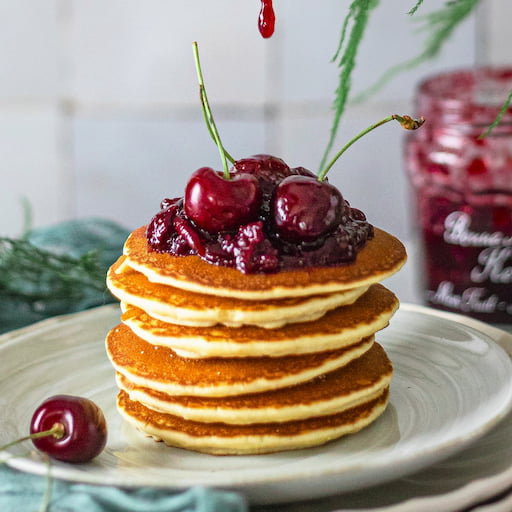
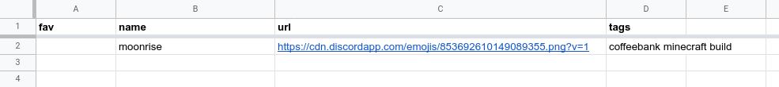

# Cherry Emotes

<component-coghero cog="emotes" desc="Custom emote solution for non-nitro users. Use animated emotes in your server, even without Nitro. Make your own emote storage spreadsheet and generate emote-like image links for use in DMs and elsewhere."></component-coghero>

> ⚠️ **Notes**  
> Due to a recent Discord update, please ensure you are only adding emotes that are from servers your bot can access. Otherwise, emotes may not display properly.

 

The emotes cog is powerful in its support to search through a public spreadsheet using the Google Sheets API.

## Prerequisites
- Your own Google Sheets API key (free)
- A public Google Spreadsheet (either one that you made, or one you have permission to use)

## Google Sheets template

Spreadsheet ID: `https://docs.google.com/spreadsheets/d/`**`1a2B3c4D5e6F7g8H9i10J11k12L13m14N`**`/edit...`

Share settings: Public, allow whoever has the link to view

- fav: TRUE or empty
- name: string
- url: string
- tags: string
- server: string (optional)

Name and tags are searched when you run the search command.

For example:
- name: KyaruDance
- tags: party nod

Any search for `dance`, `party`, `kyaru` will include KyaruDance emote in the search results.

## How it works

You right click > Copy Image URL in Discord for the emote. All the spreadsheet does is provide a frontend to store all those links. The bot can search through the frontend and return the link back to you, with extra parameters to shrink the size down to almost-a-real-emote size.

No images are saved by the spreadsheet or the bot. Only the public Discord emote's link.
