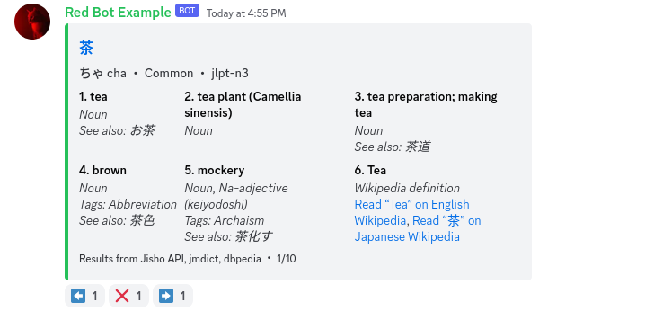

# 🍵 茶 Cha for Japanese

A delightfully refreshing Discord bot for learning and searching Japanese.

<component-coghero cog="jadict" desc="Japanese dictionary bot. Searches Jisho using Jisho API. Includes alternate links to Wiktionary, DeepL, and Google Translate."></component-coghero>

**jadict** is a Discord bot for fetching dictionary results for Japanese words, kanji, hiragana, and katakana in English. You can search for results in Japanese or English.

`ja` is the [ISO 639-1 language code](https://en.wikipedia.org/wiki/List_of_ISO_639-1_codes) for Japanese.
