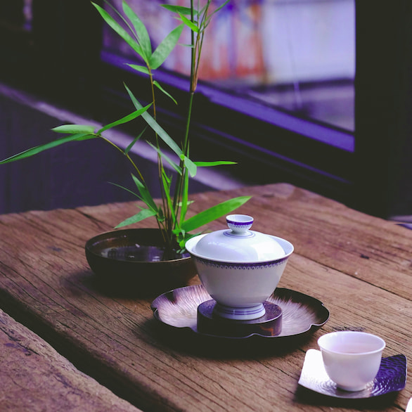

# 🍵 차 Cha for Korean

A delightfully refreshing Discord bot for learning and searching Korean.

<component-coghero cog="kodict" desc="Korean dictionary bot. Searches National Institute of Korean Language's Korean-English Learners' Dictionary (한국어기초사전) using their Open API."></component-coghero>

## Krdict API Key

(Docs coming soon)

https://krdict.korean.go.kr/openApi/openApiInfo

`[p]set api krdict api_key,YOURAPIKEYHERE`
