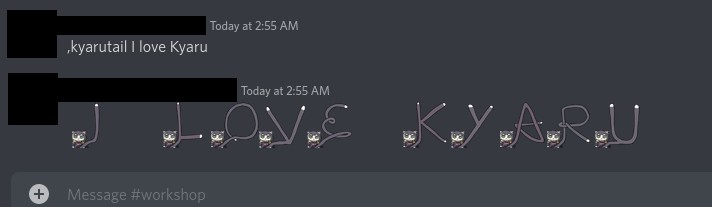

# kyarutail

<component-coghero cog="kyarutail" desc="Convert your messages into a message written with emotes of Kyaru's tail. Kyaru (aka. Karyl) is a character from Princess Connect! Re:Dive."></component-coghero>

This Kyarutail cog is a Discord bot for converting text you type into emote letters from Kyaru's tail.

Kyaru, also known as Karyl in the English version, is a character from Priconne (Princess Connect! Re:Dive).

⚠️ Previously, this bot could directly output Kyarutail emotes. Due to a Discord update in 2022, this feature now requires a workaround.

## Prerequisites

⚠️ This cog relies on access to Kyarutail emotes. Emotes are not included in this cog.

To source Kyarutail emotes, you can:
- Join the (private) Kyarutail Discord server and use Discord Nitro
- Add the Kyarutail emotes pack in [NQN bot](https://nqn.blue)
- Use Kyarutail emotes you've added to your own Discord server

## How it works

Once you have access to the Kyarutail emotes, it may be tedious to manually type the letters out. This cog will translate text (abc) into emotes (:kyaruA::kyaruB::kyaruC:), which can then be sent in chat.

### Setup

The text this bot will output is in the format `:kyaruA:`, `:kyaruB:`, etc. If you are sourcing the Kyarutail emotes from your own Discord server, it is best to name the emotes similarly for convenience.

### Limitations

Previously, this command could directly output Kyarutail emotes. Due to a Discord update in 2022, this feature now requires a workaround. The old functionality has been moved to `[p]kyaruself`.

## Disclaimers

This cog does not save or store any images. This cog does not collect user data.

Kyarutail cog is not endorsed by the creator of Kyarutail, Princess Connect! Re:Dive, or the (private) Kyarutail Discord server.
