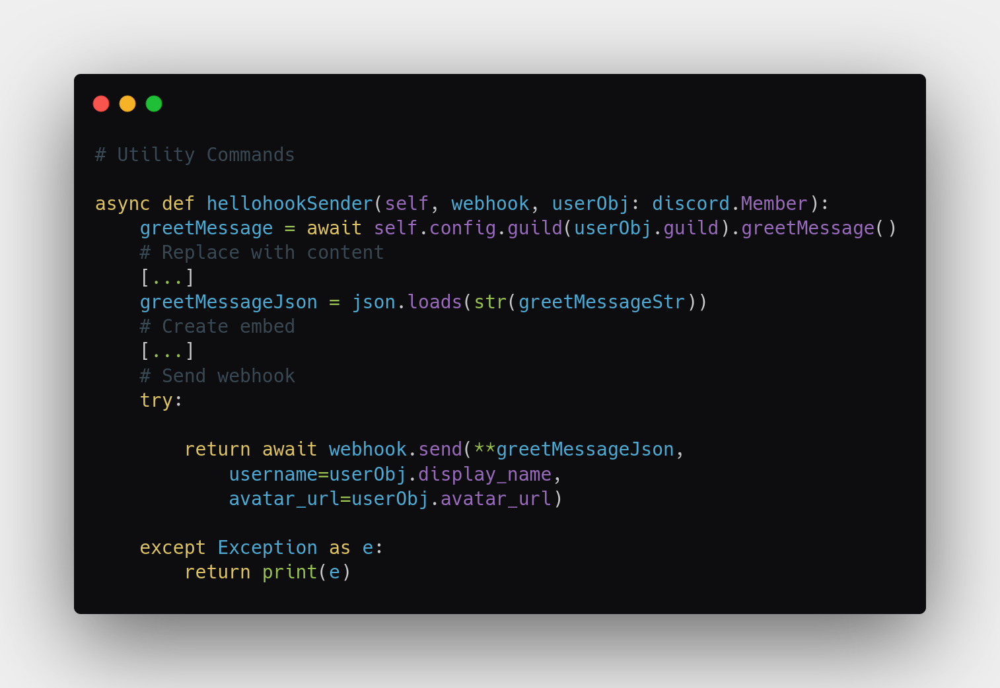

# Hellohook

<CogHero cog="hellohook" desc="Create your own welcome bot with a custom profile picture! Choose between a regular message or an embed welcome, with a ping option." />


## Drafting your Webhook Message

### [Get started on Discohook >](https://discohook.org/?data=eyJtZXNzYWdlcyI6W3siZGF0YSI6eyJjb250ZW50IjpudWxsLCJlbWJlZHMiOlt7InRpdGxlIjoiVGl0bGUgU2FtcGxlIiwiZGVzY3JpcHRpb24iOiJEZXNjcmlwdGlvbiBTYW1wbGUiLCJjb2xvciI6MTAwNjYzNjMsImF1dGhvciI6eyJuYW1lIjoiQXV0aG9yIFNhbXBsZSJ9LCJmb290ZXIiOnsidGV4dCI6IkZvb3RlciBTYW1wbGUifSwiaW1hZ2UiOnsidXJsIjoiaHR0cHM6Ly9jZG4uZGlzY29yZGFwcC5jb20vYXR0YWNobWVudHMvODc1OTA3MTU3ODUyMjk5Mjc0Lzg3NTkwNzQ3NzIzNTk4MjM1Ni91bnNwbGFzaC5jb20tcGhvdG9zLVg0NUd5SXBqcFpjLmpwZyJ9fV19fV19)  

When you are done on Discohook:
- Scroll to the bottom
- Click "JSON Data Editor"
- Click "Copy to Clipboard"
- Paste it into the bot command

*Disclaimer: Discohook is a website that makes creating webhooks easy. Not affiliated with this cog. [Image from Unsplash.](https://unsplash.com/photos/X45GyIpjpZc)*

<br />

## Variables

> **`https://&&SERVERCOUNT&&`** for server member count (268)

> **`https://&&SERVERCOUNTORD&&`** for server member count with the th/st/nd ordinals (268th)

> **`https://&&USERAVATAR&&`** for user profile picture url

> **`https://&&USERMENTION&&`** for user mention (`<@1234567890123456>`)

- User mentions can only be used in Content, or the Embed's Body Description, or they won't appear correctly.

> **`https://&&USERNAME&&`** for username as text (`Clyde`)

> **`https://&&USERNAME1234&&`** for username#1234 as text (`Clyde#1234`)

<br />

**Adding https:// in front is required.**  
Discohook will not export the needed JSON if it says "Invalid URL" (even though the bot will make them valid at runtime), so this is a workaround.

<br />


## Examples

After you save them into the bot, when a new user joins, the variables will be replaced with the new user's info.

- [Ping a user when they join + send an embed](https://discohook.org/?data=eyJtZXNzYWdlcyI6W3siZGF0YSI6eyJjb250ZW50IjoiaHR0cHM6Ly8mJlVTRVJNRU5USU9OJiYiLCJlbWJlZHMiOlt7InRpdGxlIjoiV2VsY29tZSB0byBIZWxsb2hvb2sgOikiLCJkZXNjcmlwdGlvbiI6IkxvcmVtIGlwc3VtIGRvbG9yIHNpdCBhbWV0LCBjb25zZWN0ZXR1ciBhZGlwaXNjaW5nIGVsaXQsIHNlZCBkbyBlaXVzbW9kIHRlbXBvciBpbmNpZGlkdW50IHV0IGxhYm9yZSBldCBkb2xvcmUgbWFnbmEgYWxpcXVhLiIsImNvbG9yIjoxNDUwMDY3NSwidGh1bWJuYWlsIjp7InVybCI6Imh0dHBzOi8vJiZVU0VSQVZBVEFSJiYifX1dfX1dfQ)  


<br />


## FAQ

### **Hellohook and the test command doesn't send anything!**

First, check your Red Bot console.

If it says `send() got an unexpected keyword argument '####'`, please let me know in the [Support Discord](/discord) or file a GitHub bug report.

As of 10 June 2022, this has been patched, but may happen again in the future.

### **Hellohook still works, but Greet Message is empty!**

Note for old users: Data has been upgraded to V2 system as of late 2021. Your data is saved. Greet Message will show as empty until a new user joins, which will activate the data migration process automatically. See **`[p]hellohook set`** for more info.

### **How do I send a webhook styled as the person who joined?**

This feature is not recommended. But, Hellohook is open-source, so I encourage you to customize the bot by [forking the code](#forking-hellohook).

What you want to edit is:
```
return await webhook.send(**greetMessageJson)
```

Replace it with:
```
return await webhook.send(**greetMessageJson,
    username=userObj.display_name,
    avatar_url=userObj.avatar_url)
```




## Forking Hellohook

<CogFork cog="hellohook" />
